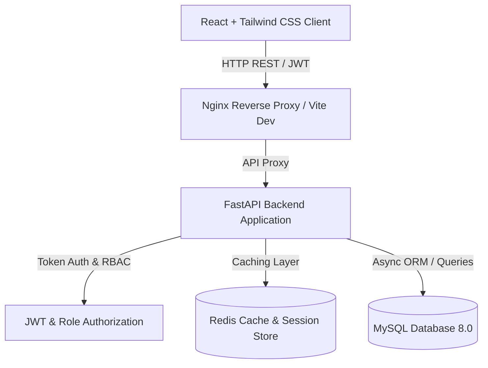
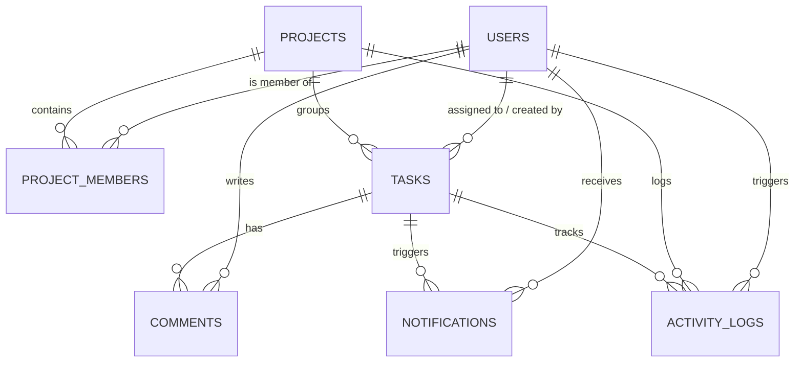

# TaskFlow - Enterprise Task & Project Management System

[](https://fastapi.tiangolo.com)
[](https://reactjs.org)
[](https://www.mysql.com)
[](https://redis.io)
[](https://www.docker.com)
[](https://docs.pytest.org)

**TaskFlow** is a production-grade, full-stack SDE portfolio project designed to demonstrate modern software engineering practices: clean modular architecture, async I/O, Role-Based Access Control (RBAC), multi-level caching with Redis, fluid drag-and-drop Kanban interaction, automated database seeding, and multi-container Docker deployment.

---

## 🌟 Key Features

- **Authentication & Security**:
  - OAuth2 Password Bearer JWT Authentication (Access + Refresh token rotation).
  - Bcrypt salted password hashing with secure payload guards.
  - Granular **Role-Based Access Control (RBAC)** across `ADMIN`, `PROJECT_MANAGER`, and `MEMBER`.
- **Project Management**:
  - Full CRUD with lifecycle states (`PLANNING`, `ACTIVE`, `ON_HOLD`, `COMPLETED`, `ARCHIVED`).
  - Project member assignment with custom roles (`MANAGER`, `CONTRIBUTOR`, `VIEWER`).
  - Real-time task progress metrics calculation per project.
- **Interactive Kanban Board & List Views**:
  - Smooth Drag-and-Drop column transitions (`TODO`, `IN_PROGRESS`, `REVIEW`, `COMPLETED`).
  - Optimistic UI updates with instant backend synchronization and column position re-indexing.
  - Alternative sortable list/table view with inline status updates.
- **Multi-Criteria Search & Filtering**:
  - Full-text search with debounce across task title and description.
  - Granular filtering by Priority (`URGENT`, `HIGH`, `MEDIUM`, `LOW`), Status, Assignee, Project, and Tags.
- **Task Discussions & Comments**:
  - Real-time threaded discussions per task with author avatars and timestamps.
- **In-App Notifications**:
  - Real-time alert polling for task assignments, status changes, and approaching deadlines.
  - Notification popover with unread badge counter and one-click "Mark all as read".
- **Analytics & Dashboard**:
  - Completion doughnut charts and priority distribution bar charts via Recharts.
  - Team workload distribution monitoring.
  - Real-time audit trail and project activity feeds.
- **High-Performance Redis Caching**:
  - Sub-millisecond cached responses for hot dashboard statistics and project queries.
  - Smart cache invalidation upon task updates, moves, or project mutations.
  - Graceful degradation: falls back to direct database execution if Redis is unavailable.
- **Pre-Configured Demonstration Accounts**:
  - Comes pre-seeded out of the box with realistic projects, tasks, and demo users.

---

## 🏗️ Architecture & Database Schema



### Database Entity-Relationship Diagram



---

## 🚀 Quickstart via Docker Compose

To launch the complete application with **FastAPI, React (Nginx), MySQL 8.0, and Redis**:

```bash
# 1. Clone or navigate to the repository root
cd "Task managment"

# 2. Build and start all services in detached mode
docker compose up --build -d
```

### Service Endpoints:
- **Frontend Web UI**: [`http://localhost:3000`](http://localhost:3000)
- **Backend Swagger API Docs**: [`http://localhost:8000/api/v1/docs`](http://localhost:8000/api/v1/docs)
- **Backend ReDoc**: [`http://localhost:8000/api/v1/redoc`](http://localhost:8000/api/v1/redoc)
- **Health Check Endpoint**: [`http://localhost:8000/health`](http://localhost:8000/health)

To stop the containers:
```bash
docker compose down
```

---

## 💻 Local Development Setup (Without Docker)

### 1. Backend Setup

```powershell
# Activate the root virtual environment
.\venv\Scripts\Activate.ps1

# Install dependencies
pip install -r backend/requirements.txt

# Start the FastAPI backend server
uvicorn backend.app.main:app --reload --port 8000
```

### 2. Frontend Setup

```bash
# Open a new terminal in the frontend directory
cd frontend

# Install node packages
npm install

# Start Vite dev server
npm run dev
```

Visit [`http://localhost:3000`](http://localhost:3000) in your browser.

---

## 🧪 Running Automated Tests

Run the Pytest suite to verify authentication, project management, and task workflows:

```powershell
# From project root with venv activated:
pytest -v
```

---

## 📁 Repository Structure

```
task-management/
├── backend/
│   ├── app/
│   │   ├── api/
│   │   │   ├── v1/
│   │   │   │   ├── auth.py          # Register, Login, Refresh token, Profile
│   │   │   │   ├── users.py         # User listing and Admin role management
│   │   │   │   ├── projects.py      # Project CRUD and member assignment
│   │   │   │   ├── tasks.py         # Tasks CRUD, Kanban move, filtering
│   │   │   │   ├── comments.py      # Task threaded comments
│   │   │   │   ├── notifications.py # Real-time alerts and unread badges
│   │   │   │   ├── dashboard.py     # Analytics & KPIs aggregation
│   │   │   │   └── router.py        # API v1 router aggregator
│   │   │   └── deps.py              # JWT auth and RBAC dependencies
│   │   ├── core/
│   │   │   ├── config.py            # Pydantic Settings
│   │   │   ├── database.py          # SQLAlchemy 2.0 Async Engine & Pool
│   │   │   ├── redis.py             # Redis client with fallback
│   │   │   ├── security.py          # Bcrypt hashing & JWT codec
│   │   │   └── exceptions.py        # Custom standardized API exceptions
│   │   ├── models/                  # SQLAlchemy ORM Models
│   │   ├── schemas/                 # Pydantic v2 validation models
│   │   ├── services/                # Business logic & caching layer
│   │   ├── utils/
│   │   │   └── seed_data.py         # Automatic demo dataset seeder
│   │   └── main.py                  # FastAPI application entrypoint
│   ├── tests/                       # Pytest integration test suite
│   ├── Dockerfile
│   └── requirements.txt
├── frontend/
│   ├── src/
│   │   ├── components/
│   │   │   ├── common/              # Button, Modal, Badge, Avatar
│   │   │   ├── layout/              # Sidebar, Navbar, NotificationDropdown
│   │   │   ├── tasks/               # KanbanBoard, KanbanColumn, TaskFilterBar, ListView
│   │   │   ├── projects/            # ProjectCard, ProjectModal, MemberManager
│   │   │   └── dashboard/           # StatCard, TaskCharts, WorkloadList, ActivityFeed
│   │   ├── context/                 # Auth, Theme, and Notification contexts
│   │   ├── services/                # Axios API services
│   │   ├── pages/                   # Login, Register, Dashboard, Projects, Detail, Tasks, Users
│   │   ├── App.jsx
│   │   ├── main.jsx
│   │   └── index.css
│   ├── Dockerfile
│   ├── nginx.conf
│   └── package.json
├── docker-compose.yml
├── .env.example
└── README.md
```
